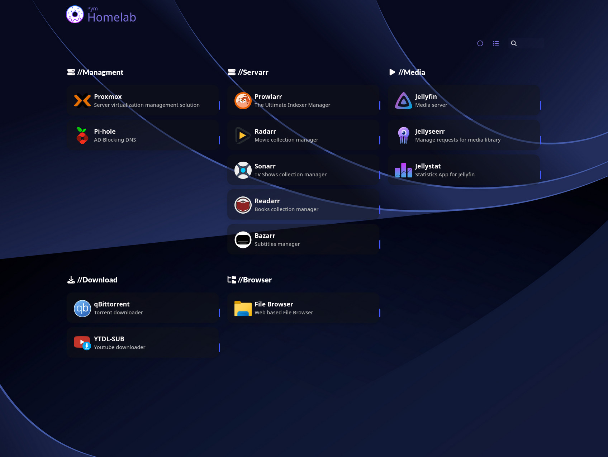

# homelab
A collection of all my configs of my home lab. 

## Navigation
* [Media](https://github.com/mateuspim/homelab/tree/main/media) - Media server with Jellyfin, arr stack and more.
* [Storage](https://github.com/mateuspim/homelab/tree/main/storage) - Current Storage and Backup Solution.
* [Raspberry](https://github.com/mateuspim/homelab/tree/main/raspberry) - Pi-hole with unbound and Homer dashboard

## Hardware

### Servers and NAS
#### Pre-built PC
An old pc upgraded to be my homelab station running Proxmox and serves as NAS, handles arr-stack, home assistant, monitoring, and many more to come.

* AMD Ryzen 5600x
* 32GB DDR4 at 2400MT/s
* 250GB NVMe SSD (Boot drive)
* x1 HDD 4TB (Main Pool) - to be upgraded

#### Raspberry Pi 2
Running Pi-hole (ad-blocking DNS), unbound (recursive DNS resolver), and Homer dashboard (Dead simple static homepage to expose your server services)

### Networking
#### [TP-Link Archer AX10](https://www.amazon.com.br/ROTEADOR-AX1500-ARCHER-AX10-TP-LINK/dp/B07YP3T5H7?ufe=app_do%3Aamzn1.fos.25548f35-0de7-44b3-b28e-0f56f3f96147)
#### [TP-Link Switch](https://www.amazon.com.br/Switch-Gigabit-Mesa-Portas-Ls1005G/dp/B07VC68RW1?ufe=app_do%3Aamzn1.fos.6d798eae-cadf-45de-946a-f477d47705b9)

### Notes
Still under construction any new information will be added asap