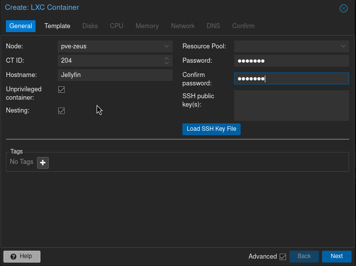
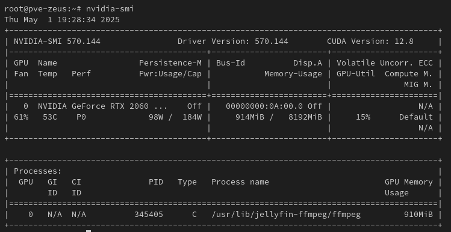
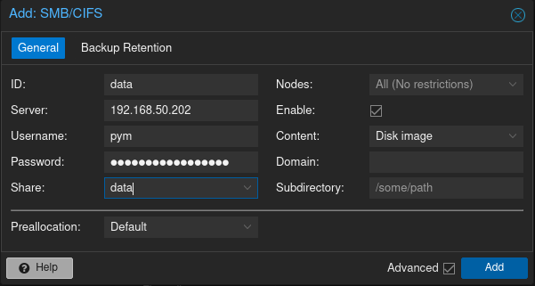

# Jellyfin Setup
This section describes all my Jellyfin configurations

## Setup

### Installation

The [Jellyfin](https://github.com/jellyfin/jellyfin) server can be installed directly to the OS using a simple [shell script](https://jellyfin.org/docs/general/installation/linux/#debian--ubuntu-and-derivatives) (if using Linux); however, Docker simplifies updates, provides better isolation, and is easier to maintain compared to direct installation.

Below is an example of a simple Docker Compose configuration for Jellyfin
```
  jellyfin:
    image: lscr.io/linuxserver/jellyfin:latest
    container_name: jellyfin
    environment:
      - PUID=1000
      - PGID=1000
      - TZ=America/Sao_Paulo
    volumes:
      - /docker/jellyfin/library:/config
      - /mnt/data/series:/data/tvshows
      - /mnt/data/movies:/data/movies
      - /mnt/data/anime:/data/anime
    ports:
      - 8096:8096
    # - 8920:8920       # Https webUI
      - 7359:7359/udp   # Service Discovery
      - 1900:1900/udp   # Client Discovery
    restart: unless-stopped
```

When using the Device Passthrough feature in Proxmox VMs, the resource becomes tied to a specific VM and cannot be shared with others. To enable multiple VMs to share the same resource, it is necessary to switch to using LXC Containers, which is the approach I am now adopting.

Setting up a new LXC Container is as simple as pressing the _Create CT_ button at the top of the page.



**Note** If this is the first LXC container you are creating, I recommend refraining from installing Jellyfin for now. Instead, install all necessary NVIDIA software, such as the NVIDIA drivers and CUDA toolkit, so you can later clone this container for new LXC containers as needed.

## Hardware Transcoding

This section will focus on transcoding with NVIDIA GPUS. 


### Proxmox + LXC container Setup

Installing NVIDIA Drivers is a lengthy process, and there is ample documentation on the web. Key steps include installing the NVIDIA drivers in the host system, and configuring the LXC container to allow GPU passthrough by modifying its configuration file to include the necessary device mappings. 
To do so, I checked the following guides for detailed instructions:
* [NVidia Proxmox + LXC](https://gist.github.com/egg82/90164a31db6b71d36fa4f4056bbee2eb) guide for enabling the NVIDIA GPU on LXC Containers
* [HWA Tutorial On NVIDIA GPU](https://jellyfin.org/docs/general/post-install/transcoding/hardware-acceleration/nvidia/) guide on the Jellyfin page, which covers enabling hardware acceleration, configuring the NVIDIA GPU, and optimizing transcoding settings for better performance.

#### Notes

##### Nvidia Drivers
Proxmox VE 7.0 or greater defaults to the pure cgroupv2 environment, which is the next-generation Linux control group system used for resource management. This change is relevant to Jellyfin's hardware transcoding setup because cgroupv2 introduces a new way of managing device access, which requires updated configuration for GPU passthrough in LXC containers. It offers improved performance and flexibility compared to cgroupv1, which is being phased out in systemd and other tools. As a result, I had to modify the guide to reflect this change by updating the lines from:
```
lxc.cgroup.devices.allow: c <number from previous step>:* rwm
lxc.cgroup.devices.allow: c <number from previous step>:* rwm
lxc.cgroup.devices.allow: c <number from previous step>:* rwm
```
to:
```
lxc.cgroup2.devices.allow: c <number from previous step>:* rwm
lxc.cgroup2.devices.allow: c <number from previous step>:* rwm
lxc.cgroup2.devices.allow: c <number from previous step>:* rwm
```

Source: [Typhox/Proxmox-forum](https://forum.proxmox.com/threads/pve-7-0-lxc-intel-quick-sync-passtrough-not-working-anymore.92025/)


##### CUDA Install

The CUDA installation method in the Proxmox guide is outdated. The NVIDIA [site](https://developer.nvidia.com/cudnn-downloads) now provides updated instructions for installing the correct CUDA drivers for any Linux distribution.

##### SSH in LXC Container
Enabling ssh in LXC Container without SSL Keys by modifying the `/etc/ssh/sshd_config` file by changing:
```
#PermitRootLogin NoPassword
to
PermitRootLogin yes
```
Then after runinng: 
```
sudo service sshd restart
```

### Important: Rollback SSH Configuration

**Warning:** After completing all configurations, you must **rollback the SSH configuration** for better security. Ensure you revert the changes made to the `/etc/ssh/sshd_config` file by setting:
```
PermitRootlogin yes
to
#PermitRootLogin NoPassword
```

## Mount Points

Enabling SMB shares in an LXC container is a straightforward process; however, the steps vary depending on whether the container is **privileged** or **unprivileged**. Privileged containers have direct access to the host system and map the host's root user to the container's root user, eliminating the need for additional configuration for SMB access. Nevertheless, privileged containers are generally discouraged due to security concerns, as they provide less isolation from the host system.

Enabling SMB shares in an LXC container is straightforward, but the process depends on whether your container is **privileged** or **unprivileged**. Privileged containers have direct access to the host machine and map the host’s root user to the container’s root user, so no additional configuration is needed for SMB access. However, privileged containers are considered unsafe and should generally be avoided for security reasons.

Unprivileged containers, on the other hand, are much safer because they isolate the container’s root user from the host. This added security comes with a trade-off: you’ll need to perform extra configuration steps to ensure the container has the necessary read, write, and execute (rwx) permissions for your SMB shares.

Source: [Unprivileged LXC Containers/Proxmox](https://pve.proxmox.com/wiki/Unprivileged_LXC_containers)

### Privileged container

 First, you must go to _Datacenter → Storage → Add → SMB/CIFS_. When adding an SMB/CIFS share, you need to provide the following information:
- **ID**: A unique identifier for the share.
- **Server**: The IP address or hostname of the SMB server.
- **Username**: The username for accessing the SMB share.
- **Password**: The password for the specified username.
- **Share**: The name of the SMB share on the server.

**Note:** Make sure **Content** is set to **Disk image**, as this ensures compatibility with Proxmox storage requirements for mounting SMB/CIFS shares.  



After completing this step, you need to add new lines to the `/etc/pve/lxc/<container-id>.conf` file as shown below:

**Note:** Customize these paths (`/mnt/pve/docker` and `/mnt/pve/data`) based on your Proxmox storage configuration and the directories available on your host system.
```
mp0: /mnt/pve/docker,mp=/docker  # Mount point for Docker-related files
mp1: /mnt/pve/data,mp=/data      # Mount point for general data storage
```
**⚠️ Warning:** Performing this step will **disable cloning** of this LXC container because **Proxmox does not clone bind-mounted points**. Bind mounts reference specific host paths, which cannot be replicated during the cloning process. 
As a result, workflows requiring identical containers will need to manually reconfigure bind mounts after cloning.

### Unprivileged container

To enable RWX in unprivileged container we must follow these instructions:

1. In the LXC (run as **root**) 

- First we must go to the guest LXC and create a group `lxc_shares` with GID=10000 that will later match the GID=110000 on the PVE host by running:
  ```
  groupadd -g 10000 lxc_shares
  ```
- Then add all users that will need access to the shares to the group just created by running:
  ```
  usermod -aG lxc_shares pym
  usermod -aG lxc_shares jellyfin
  ```
- Shutdown the LXC guest machine.

2. In the PVE Host (run as **host**)

- Create the mount point by running:
  ```
  mkdir -p /mnt/lxc_shares/data
  ```
- Edit ```/etc/fstab``` and add: 
  ```
  //192.168.50.202/data/ /mnt/lxc_shares/data cifs _netdev,x-systemd.automount,noatime,uid=100000,gid=110000,dir_mode=0770,file_mode=0770,credentials=/root/.smbcredentials 0 0
  ```

- Create the ```~/.smbcredentials``` file in your home directory:
  ```
  username=username
  password=password
  domain=domain
  ```
  **Note:** Replace `username`, `password`, and `domain` with your actual SMB credentials.

- Make sure you secure your ```~/.smbcredentials``` file:
  ```
  chmod 0600 ~/.smbcredentials
  ```

- Mount with:
  ```
  sudo mount /mnt/lxc_shares/data
- Edit the `/etc/pve/lxc/<container-id>.conf` file to bind mount the share by (the `shared=1` option enables that container to be migrated across Proxmox nodes):
  ```
  mp0: /mnt/lxc_shares/data/,mp=/mnt/data,shared=1
  ```
3. Start the guest LXC container and you are good to go.

Sources:
- [TheHellSite/Proxmox Forum](https://forum.proxmox.com/threads/tutorial-unprivileged-lxcs-mount-cifs-shares.101795/) 
- [Bayton/Mount CIFS/SMB shares RW in LXD containers](https://bayton.org/docs/linux/lxd/mount-cifssmb-shares-rw-in-lxd-containers/) 

## Permissions

Changing permissions are only necessary for the OS install of jellyfin.
Now after all configured and setup just spin up the machine.
But first we must fix the permissions of the Jellyfin user by:

1. Stop the Jellyfin service. `sudo systemctl stop jellyfin` 
2. Edit the Jellyfin service configuration to reflect your user. `sudo nano /lib/systemd/system/jellyfin.service`. Now change the `user` and `group` to your main user. You can run the `id` command if you're unsure.

```
[Unit]
Description = Jellyfin Media Server
After = network-online.target

[Service]
Type = simple
EnvironmentFile = /etc/default/jellyfin
User = user # Change this user
Group = group # Change this group
WorkingDirectory = /var/lib/jellyfin
ExecStart = /usr/bin/jellyfin $JELLYFIN_WEB_OPT $JELLYFIN_FFMPEG_OPT $JELLYFIN_SERVICE_O>
Restart = on-failure
TimeoutSec = 15
SuccessExitStatus=0 143

[Install]
WantedBy = multi-user.target
```

3. Now change the permissions of the Jellyfin files and folders.

```
sudo chown -R user:group /etc/default/jellyfin
sudo chown -R user:group /usr/bin/jellyfin
sudo chown -R user:group /var/lib/jellyfin/
sudo chown -R user:group /etc/jellyfin/
sudo chown -R user:group /var/log/jellyfin/
sudo chown -R user:group /var/cache/jellyfin/
sudo chown -R user:group /usr/share/jellyfin
sudo chown -R user:group /usr/share/jellyfin-ffmpeg
sudo chown -R user:group /usr/lib/jellyfin/
sudo chown -R user:group /usr/lib/jellyfin-ffmpeg/
sudo chown -R user:group /tmp/jellyfin/
```

4. Reload the daemon and restart jellyfin
```
sudo systemctl daemon-reload
sudo systemctl restart jellyfin
```

5. Check the user that is running Jellyfin
```
ps -aux | grep jellyfin
```

Source: [tteck/Proxmox#286](https://github.com/tteck/Proxmox/discussions/286)

## Plugins

There are a lot of awesome Jellyfin themes and plugins available to use right off the bat with your Jellyfin server. These can be found on [awesome-jellyfin](https://github.com/awesome-jellyfin/awesome-jellyfin). Some of the ones I use are:

- [intro-skipper](https://github.com/intro-skipper/intro-skipper) - Fingerprint audio to automatically detect intro and outro segments in Jellyfin.
- [InPlayerEpisodePreview](https://github.com/Namo2/InPlayerEpisodePreview) - Adds an episode list to the video player.
- [jellyfin-editors-choice-plugin](https://github.com/lachlandcp/jellyfin-editors-choice-plugin) - Adds a Netflix-style, full-width content slider to the home page to feature selected content.
- [jellyfin-icon-metadata](https://github.com/Druidblack/jellyfin-icon-metadata) - Adds metadata provider icons to Jellyfin.
- [jellyfin-plugin-animethemes](https://github.com/EusthEnoptEron/jellyfin-plugin-animethemes?tab=readme-ov-file) - Fetches anime opening and ending themes from AnimeThemes.moe, supporting both audio and video.
- [jellyfin-plugin-home-sections](https://github.com/IAmParadox27/jellyfin-plugin-home-sections) - Allows users to customize the jellyfin-web home screen with dynamic sections like "Because You Watched" and "Latest Movies".
- [jellyfin-plugin-skin-manager](https://github.com/danieladov/jellyfin-plugin-skin-manager)- Helps you to download and install skins.

#### Notes

For some plugins to work correctly with the Docker Container it may be necessary to change the permissions of the ```index.html``` file by:

**Note** replace `user` and `group` with the `user` and `group` of your container
```
docker exec -it --user root jellyfin chown user:group /usr/share/jellyfin/web/index.html && docker restart jellyfin
```

## Tools

To enhance your experience running Jellyfin, I recommend the following tools:

#### Jellyseerr

Jellyseerr is an application for managing requests for your media library. For more info, visit the [Jellyseerr GitHub repository](https://github.com/fallenbagel/jellyseerr).

#### Jellystat
An all-purpose Statistics tool for Jellyfin. For more info, visit the [Jellystat GitHub repository](https://github.com/CyferShepard/Jellystat).
