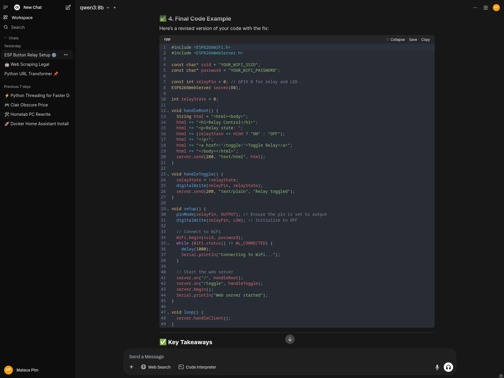

# Homelab Tools Overview

This document provides an overview of the tools used in my homelab setup. Each tool is briefly described, and an example image is included to showcase its functionality.

## AI

###  Ollama

Ollama is a tool for managing and deploying machine learning models locally. It simplifies the process of running AI models on your own hardware.
Currently, I run Ollama in an Unprivileged LXC Container to share the GPU with another container running Jellyfin. It can be installed simply by running:
```
curl -fsSL https://ollama.com/install.sh | sh
```


Source: [Ollama](https://ollama.com/)

###  Open WebUI

Open-WebUI is a web-based user-friendly interface for interacting with local and remote LLMs, including Ollama. It can be enhanced with tools like SearxNG, which integrates seamlessly to provide private web search capabilities directly within the interface.


Source: [Open WebUI](https://github.com/open-webui/open-webui)

###  SearxNG

SearxNG is a privacy-respecting metasearch engine. It aggregates results from multiple search engines without tracking your activity.


Source: [SearXNG on open-webui](https://docs.openwebui.com/tutorials/web-search/searxng/)

## Software Development - IDE & Tools

###  Code-Server

Code-Server allows you to run Visual Studio Code in the browser, hosted on my homelab server. For example, it is particularly useful for debugging code or making quick edits to scripts while on the go, ensuring productivity from any device with a browser.


Source: [Code server docker](https://hub.docker.com/r/linuxserver/code-server)

**Additional Notes**: I run a modified code-server image to avoid reinstalling Python, Go, Java, and Rust compilers every time. Additionally, I added UV, a lightweight Python package manager designed for enhanced dependency management and faster installations, to streamline Python workflows. To achieve this, you must clone the Docker code-server repository and build it locally with your changes like:
```
git clone https://github.com/linuxserver/docker-code-server.git
cd docker-code-server
```
Edit the Dockerfile using your preferred text editor (e.g., nano, vim, or VS Code) and add the following to it:
```
# Update and install Python3, Go, Java, and Rust
RUN \
  echo "**** install python3, GO, Java and Rust ****" && \
  apt-get update && \
  apt-get install -y \
    python3 \
    python3-pip \
    golang \
    default-jre \
    rustc && \
  apt-get clean

# Install UV, a Python package manager, for enhanced package management capabilities
# More details: https://docs.astral.sh/uv/guides/integration/docker/#installing-uv
COPY --from=ghcr.io/astral-sh/uv:latest /uv /uvx /bin/
```
after that you can just build the image by:
```
docker build \
  --no-cache \
  --pull \
  -t lscr.io/linuxserver/code-server:latest .
```

## Productivity

###  Excalidraw

Excalidraw is a virtual whiteboard tool for sketching diagrams and brainstorming ideas. It is simple, intuitive, and great for quickly visualizing ideas, such as creating flowcharts, mind maps, or wireframes for projects.


Source: [Excalidraw self-hosting](https://docs.excalidraw.com/docs/introduction/development#self-hosting)

###  AFFiNE

AFFiNE is a self-hostable alternative to Notion, combining note-taking, task management, and whiteboarding into a unified workspace for organizing and sharing ideas.


Source: [Self-host AFFiNE](https://docs.affine.pro/docs/self-host-affine)
